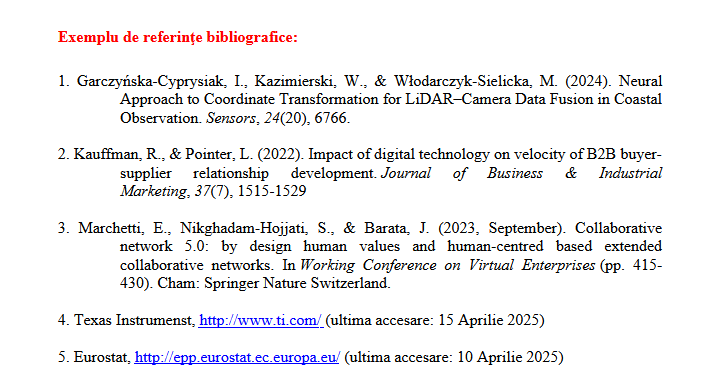
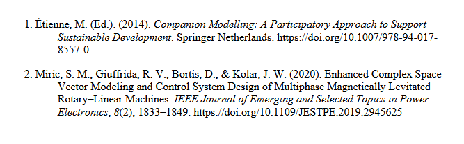

# Citation styles

Formatul de bibliografie si citatii pentru lucrarile din Sesiunea de Comunicari Stiintifice al AII este derivat din stilul APA (American Psychological Association), cu numerotare stil IEEE.

In modelul AII formatul este:

Stilul din `./politehnica-bucuresti-apa-derived.csl` arata asa: 

Stilurile sunt specificate utilizand CSL - Citation Style Language.

Am creat un `.csl` care sa reflecte cerintele de formatare date de AII.

Sursele jurnalelor cunoscute sunt disponibile in format CSL aici: https://github.com/citation-style-language/.

Din `apa.csl` am derivat `politehnica-bucuresti-apa.csl`, care folosete ca referinta formatul din ieee.csl `[1]` si bibliografia in stilul APA, la care am adaugat indexul ca `1. `.

### despre csl
Elementele care definesc formatul se gasesc de obicei la [finalul documentului](https://github.com/citation-style-language/styles/blob/b8070a75b46cdf0d0c14ebc9ff17c284ebc92d09/ieee.csl#L317-L511) .csl. Acestea sunt:

* `<citation>` -- pentru formatul referintei din text, in cazul IEEE este "[1]"
* `<bibliography>` -- pentru formatul intrarilor din bibliografia de la finalul documentului.

### cum aplic stilul
Folosesc [Zotero](https://zotero.com), unde stochez PDF-uri, site-uri pe care vreau sa le referentiez, etc. 

Zotero are pluginuri pentru LibreOffice, google docs, etc.. si permite selectarea stilului de citatie precum si cautarea si inserarea citatiilor din bibliografia locala. Recomand!

Tips despre cum sa editezi/folosesti stiluri pentru bibliografie: https://www.zotero.org/support/dev/citation_styles/style_editing_step-by-step

## Erori in LibreOffice la update-ul bibliografiei?
**TL;DR: tine toate citatiile in paragrafe simple in textul principal. Evita sa adaugi citatii "[1]" in text care se afla in Tabele, Caption-uri ale imaginilor, etc..**

Integrarea [zotero-libreoffice](https://github.com/zotero/zotero-libreoffice-integration/blob/39a4b0586c110d9ed42561295bc36e4e0383c793/build/source/org/zotero/integration/ooo/comp/TextTableManager.java#L64) merge ok in general, dar daca o surprinzi cu citatii in afara locurilor tipice (paragrafe din textul principal), poate da erori care suna cam "LibreOffice could not communicate with Zotero. [...] Would you like to troubleshoot?".

# Dictionar Roman pentru Libre Office
Am inclus in repo si un dictionar roman descarcat de la https://rospell.wordpress.com/download/. Libre office nu include limba romana in instalarea default, dar e foarte util sa ai spell checking.

Ca sa instalezi dictionarul in LibreOffice Writer, mergi la Tools -> Extensions (Alt-Ctrl-E), apasa "Add" si selecteaza fisierul `dict-ro.1.7.oxt` din acest repo.
